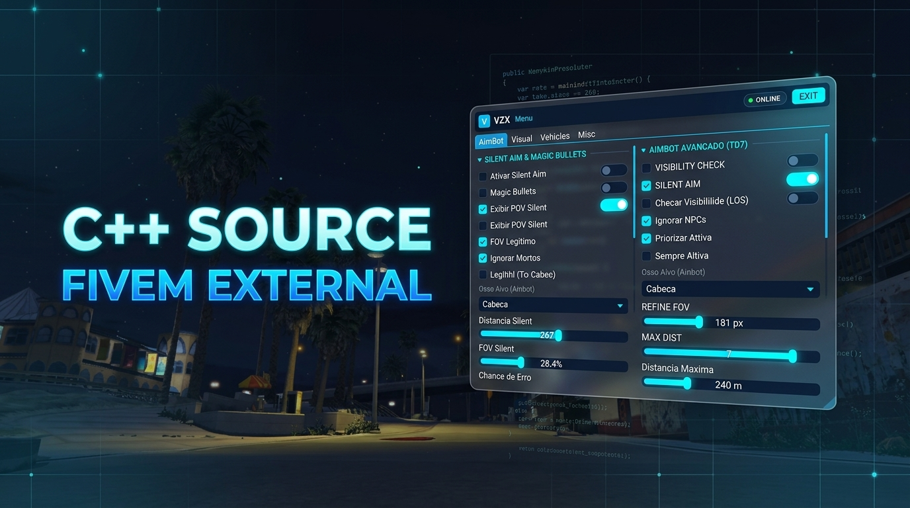

<div align="center">

# ⚡ VZX FiveM External — C++ & Dear ImGui

[](https://en.wikipedia.org/wiki/C%2B%2B17)
[](https://microsoft.com)
[](https://docs.microsoft.com/en-us/windows/win32/direct3d11/atoc-dx-graphics-direct3d-11)
[](https://github.com/ocornut/imgui)

Uma base **External** moderna, limpa e de alta performance para **FiveM**, desenvolvida em C++17 com overlay transparente renderizado via DirectX 11 e interface estilizada em **Dear ImGui (Dark Cyan Glassmorphism)**.

<br>



<br>

### 📺 Assista ao vídeo de demonstração:
[](https://youtu.be/LfcrmNtfNaQ?si=KoWiTh44p1d9jukl)

</div>

---

## 🎯 Funcionalidades

### 🔴 Combate & Sistema de Mira (AimBot / Silent Aim)
- **Silent Aim (Rocket V14):** Injeção de vetor de disparo diretamente no `BulletHandler` com proteção `VirtualProtectEx`.
- **Magic Bullets:** Modificação e cálculo de trajetória de bala no `CWeapon + 0x20`.
- **Aimbot Avançado (TD7):** 
  - Cálculo de ângulos de câmera com interpolação suave (**Smooth / Speed**).
  - **Line of Sight (LOS):** Verificação de visibilidade por raycast/física de jogo com cache concorrente.
  - **Predição de Movimento:** Cálculo preditivo baseado no vetor de velocidade da entidade alvo.
  - Priorização de alvos por **FOV** ou por **Menor Distância**.
  - Suporte a seleção de ossos: Cabeça, Pescoço, Torso, Mãos e Pés.
- **TriggerBot:** Disparo automático por varredura de colisão de cabeça com atraso configurável (Delay em ms).
- **Círculos de FOV:** Desenho dinâmico do campo de visão (FOV) do Silent Aim, Aimbot e Triggerbot diretamente no overlay.

### 👁️ Visual (ESP)
- **Box 2D:** Estilos Full 2D, Cornered Box e Rounded Box com preenchimento translúcido.
- **Snaplines:** Linhas rastreadoras dinâmicas com origem no Topo, Centro ou Base da tela.
- **Skeleton ESP:** Suporte a esqueleto Simples (9 ossos) e Complexo (Full Body).
- **HealthBar & ArmorBar:** Barras de vida e blindagem dinâmicas com gradiente de cor.
- **Detecção de Admins Invisíveis:** Identificação de entidades em modo espectador ou com alpha zerado.
- **ESP de Veículos:** Exibição de modelo, distância e status da trava da porta (Travado/Destravado/Ocupado).

### 🛠️ Sistema & Arquitetura
- **Multithreading Concorrente:** Leitura de entidades (`UpdateList`) e veículos (`UpdateVehicles`) isoladas em threads dedicadas com **Double Buffering** (`std::shared_ptr`).
- **Suporte Multi-Build:** Compatibilidade com builds **b3095** e **b3258** do FiveM.
- **Overlay Transparente DX11:** Renderização externa em camada sobreposta com suporte a bypass de captura (StreamProof).

---

## 🚀 Como Compilar

### Pré-requisitos:
- **Windows 10 / 11 (64-bit)**
- **Visual Studio 2022** com a carga de trabalho de desenvolvimento para Desktop em C++ instalada (ferramentas MSVC v143).
- **Windows SDK** 10.0 ou superior.

### Passos de Compilação:
1. Clone este repositório:
   ```bash
   git clone https://github.com/volphzz/Fivem-External-vzx.git
   ```
2. Abra a solução no Visual Studio:
   - Abra a pasta ou o arquivo `FiveM-External.vcxproj`.
3. Defina a configuração de build para:
   - **Configuration:** `Release`
   - **Platform:** `x64`
4. Compile a solução (`Ctrl + Shift + B` ou menu **Build > Build Solution**).
5. O executável final será gerado em:
   ```
   x64/Release/FiveM-External.exe
   ```

---

## 🎮 Como Usar

1. Inicie o seu **FiveM** e entre no servidor desejado.
2. Execute o `FiveM-External.exe` como Administrador.
3. Use a tecla **INSERT** para abrir/fechar o menu de configurações.
4. Ajuste as opções de combate, ESP e atalhos conforme sua preferência.

---

## ⚠️ Aviso Legal / Disclaimer

Este projeto foi desenvolvido **estritamente para fins educacionais, de pesquisa e aprendizado** sobre arquitetura interna do sistema operacional Windows, renderização externa com DirectX 11, injeção de overlays gráficos com Dear ImGui e manipulação básica de memória de processos.

O autor não se responsabiliza pelo uso indevido deste software em servidores online públicos ou privados.

---

<div align="center">
Desenvolvido com foco em código limpo, estabilidade e performance.
</div>
